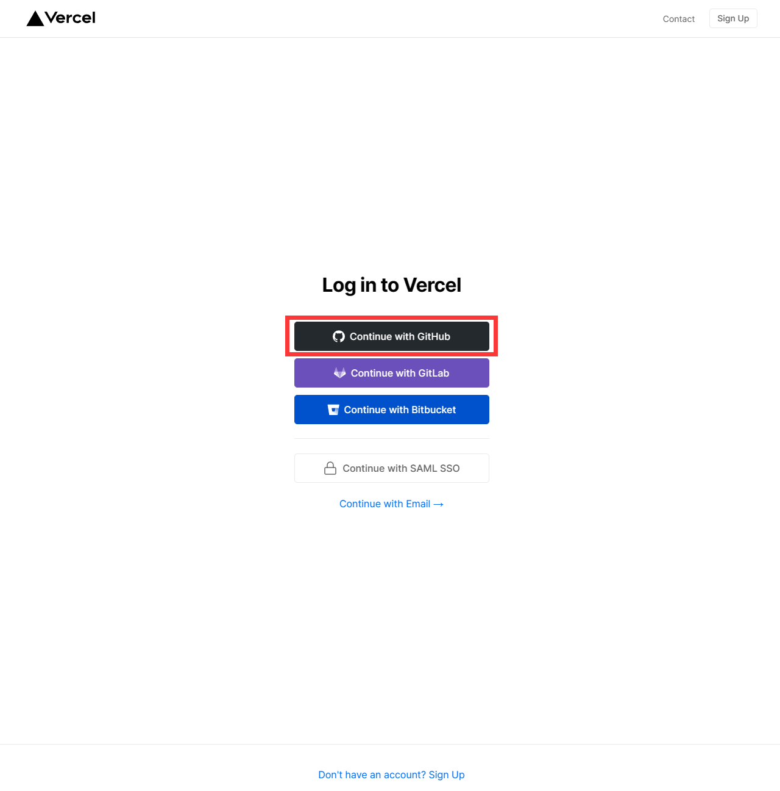
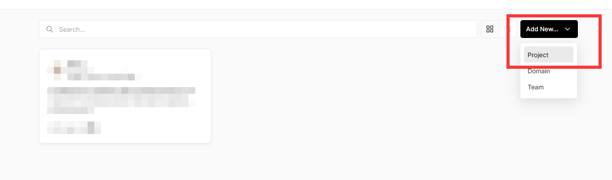
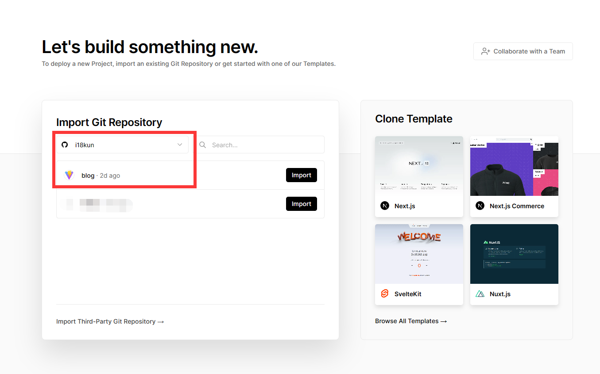
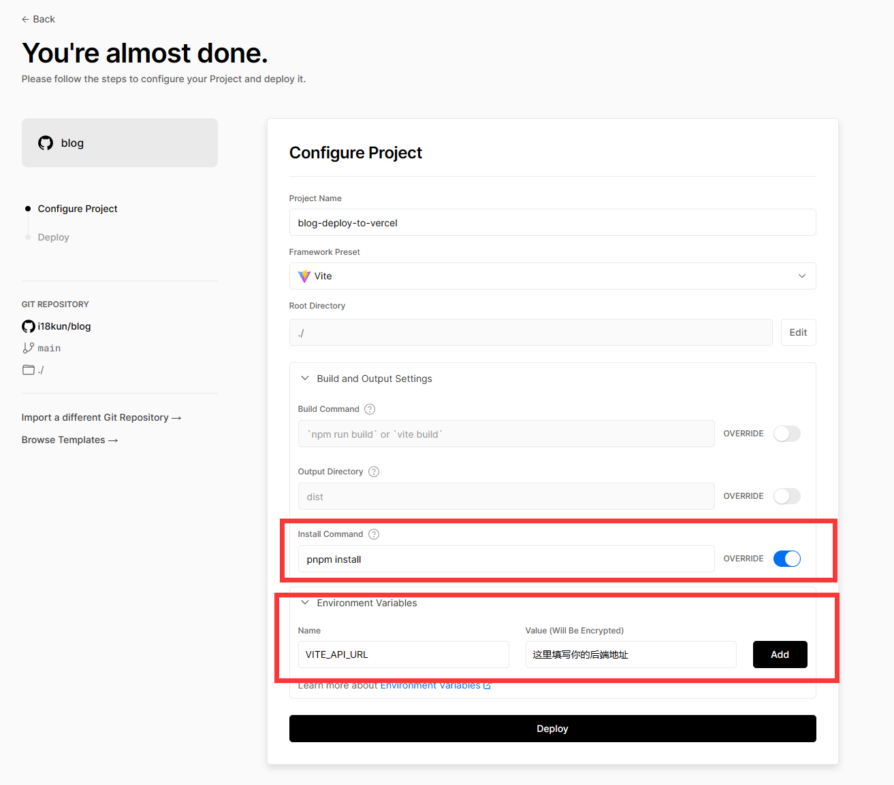
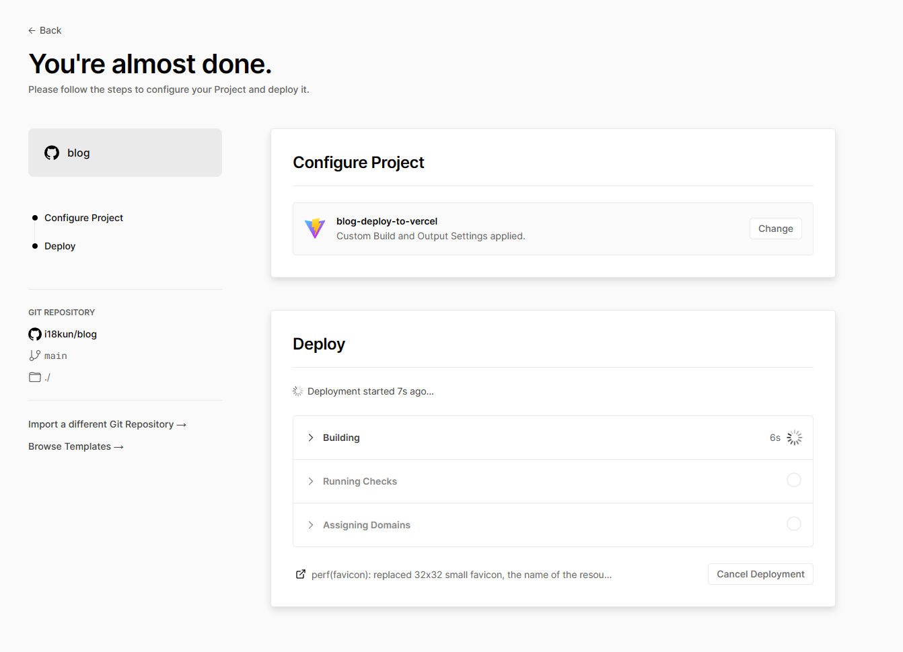
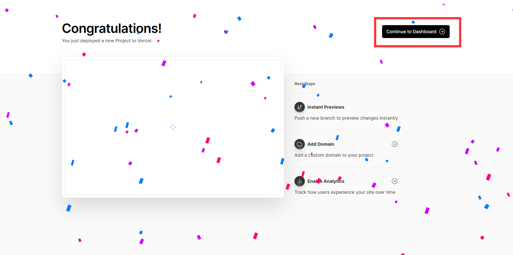
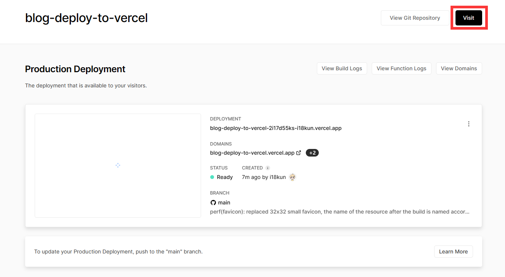

# 佳垚的论坛

基于 Vite+React18+Redux+TypeScript+Antd 的论坛前端

## Getting Started

在开始前请检查你的 [Node.js](https://nodejs.org/en/) 版本，推荐使用 `node18 LTS` 的版本

### 本地部署

在根目录创建 `.env.development` 和 `.env.production` 两个文件，分别用于开发环境和生产环境

```dotenv
# .env.development
VITE_API_URL=用于开发环境的后端地址，一般为http://localhost:3000
```

```dotenv
# .env.production
VITE_API_URL=用于生产环境的后端地址，在执行build命令时使用
```

安装依赖：

```bash
pnpm install
```

启动：

```bash
pnpm dev
```

部署：

```bash
pnpm build
```

执行命令后会得到 `dist` 目录，把这个目录里的所有文件放到你的站点根目录即可

### Vercel 部署

Fork 本项目到自己的仓库中

使用 GitHub 账号登录 [vercel.com](https://vercel.com)



点击 Add New... 并选择 Project



选择刚刚 fork 的仓库



重写 Install Command 参数，打开 OVERRIDE 选项，输入 `pnpm install`

添加环境变量，填写 `VITE_API_URL` 在 Name 字段，填写你的后端地址在 Value 字段，点击 Add 完成添加

上述步骤完成后点击 Deploy 即可开始部署



耐心等待项目部署完成



部署完成后点击 Continue to Dashboard 前往主页



点击 Visit 即可查看刚刚部署的网页



至此，完成了在 Vercel 平台上部署

### 后端部署

请阅读[参考文档](./server/README.md)
