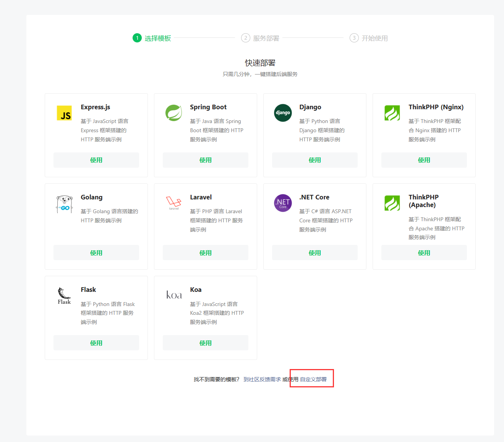
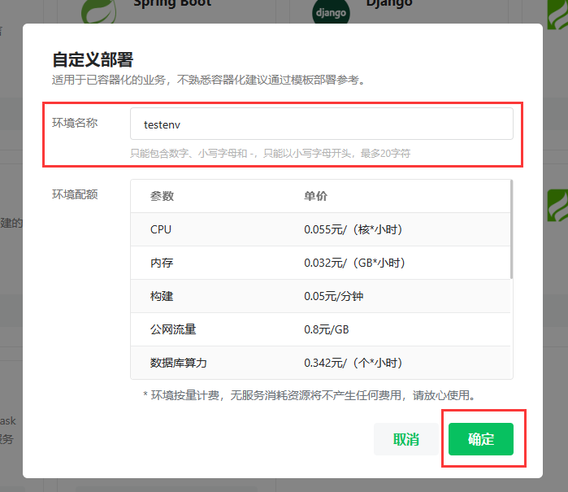
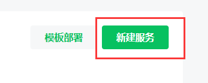
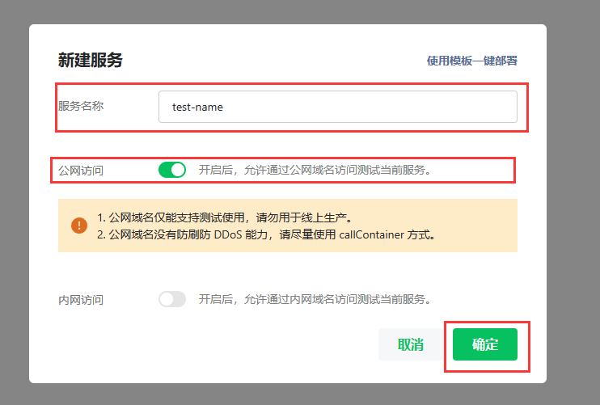
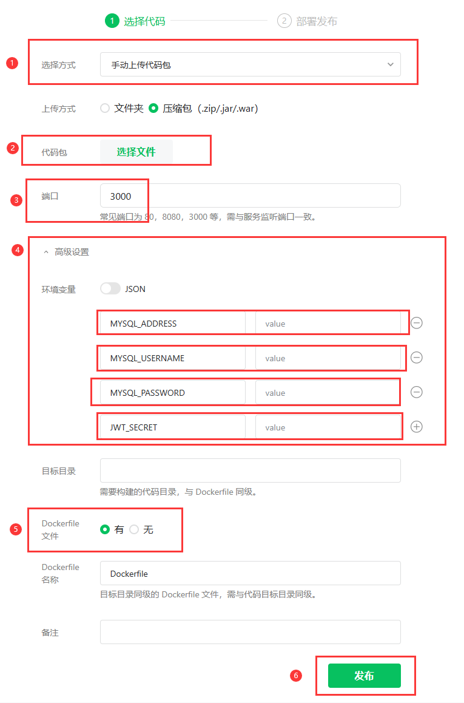
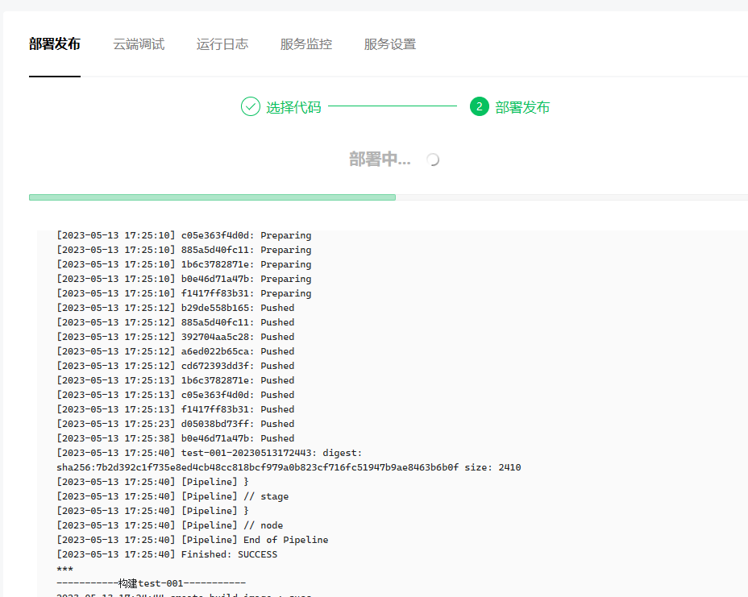
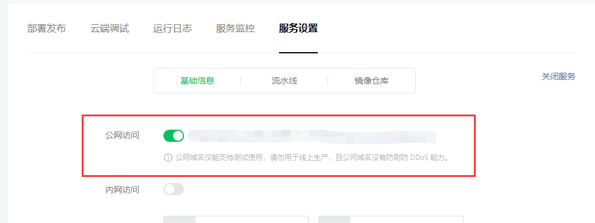

# 论坛后端

## Getting Started

推荐使用 Docker 或微信云托管部署，不推荐使用本地部署

### 本地部署

在根目录创建 `.env` 文件，用于配置受保护的环境变量

```dotenv
MYSQL_ADDRESS=mysql数据库地址
MYSQL_USERNAME=用户名
MYSQL_PASSWORD=密码
JWT_SECRET=token公钥
```

安装依赖：

```bash
pnpm install
```

运行：

```bash
pnpm start
```

### 微信云托管部署

需要拥有一个微信小程序，[点击此处](https://mp.weixin.qq.com/wxopen/waregister?action=step1&source=mpregister&token=&lang=zh_CN)前往注册微信小程序

登录[微信云托管](https://cloud.weixin.qq.com/cloudrun)，新注册的小程序登录后默认会跳到快速部署页面，请选择下方的自定义部署



根据提示创建新环境，然后点击确定



环境创建完成，在服务列表页面中点击右侧的新建服务



根据提示新建服务，填写服务名称，打开公网访问，点击确定



进入刚刚创建的服务进行部署发布，选择手动上传代码包，端口为 3000，填写正确的环境变量，选择有 Dockerfile，点击发布



开始部署，等待项目部署完成



部署完成后，在服务设置页面中找到公网访问，后边的地址就是公网地址



至此，完成了在微信云托管平台上部署后端

### Docker 部署

已提供 Dockerfile 文件，自行使用`docker build`命令构建镜像以及添加环境变量即可
